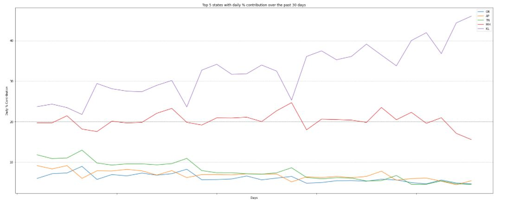

# Covid-19 India State-Wise Daily Cases Visualization

## Language - Python3

## IDE - Jupyter Notebook

## Library requirements:-
1. pandas
2. matplotlib
3. seaborn
4. requests
5. io
6. math
7. datetime

## Data source - https://api.covid19india.org/csv/latest/state_wise_daily.csv 
    This URL always provide latest data.
    
## Result:-
    

